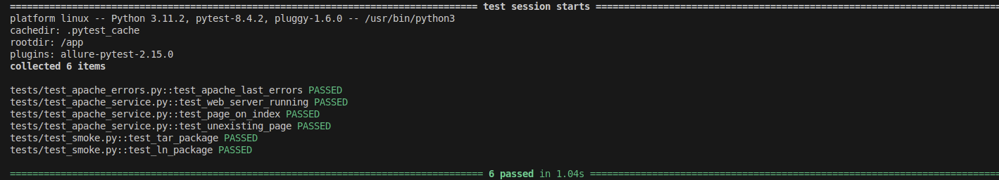
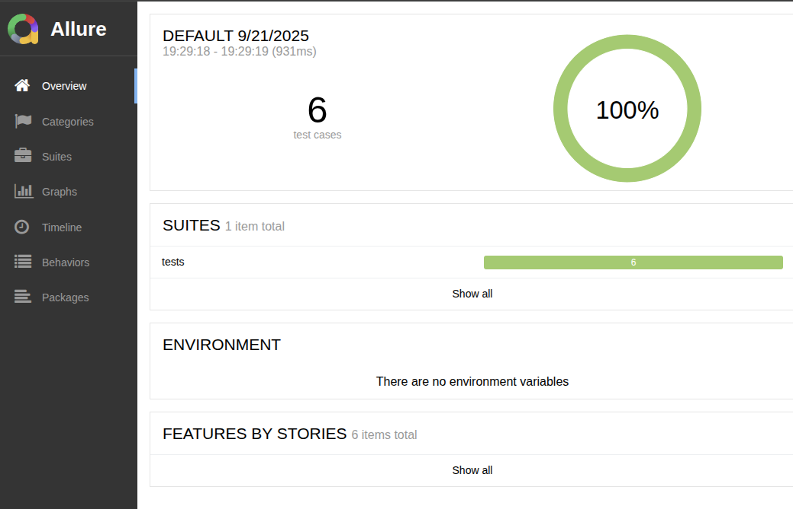
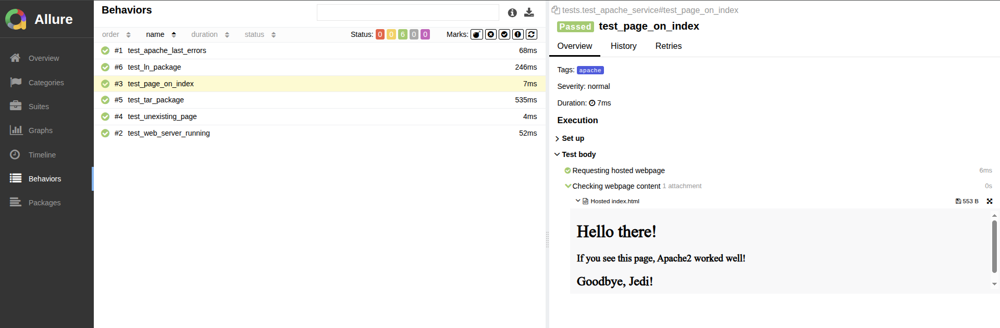
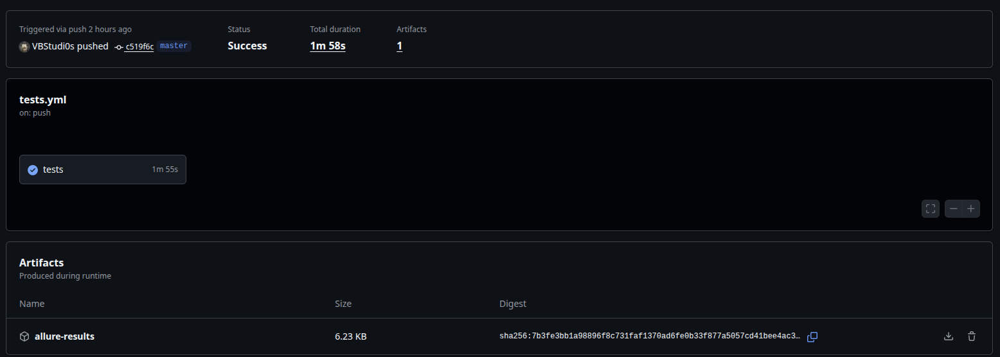

# YADRO Lab test Task

Тестовое задание в проект "Система проверки работоспособности дистрибутивов на основе Yocto" лаборатории Yadro в ЛЭТИ.

## Краткое описание

Система автоматического тестирования веб-сервера Apache при помощи Pytest и Allure. Система тестирования (agent) содержит
ряд тестов для проверки работоспособности и корректности работы сервера Apache (target) на базе образа `debian:bookworm-slim`.
Результаты тестов собираются в отчёт с помощью Allure. Также реализован набор smoke-тестов на ряд стандартных пакетов.
Тестируемый сервер (target), система тестирования (agent) и сервер для просмотра отчетов (allure) запускаются в отдельных докер-контейнерах.
Взаимодействие между контейнерами происходит через SSH и HTTP и конфигурируется с помощью Docker Compose и переменных окружения.

## Зависимости

Для запуска проекта необходимы:
- `Docker` версии 23.x и выше;
- `Docker Compose v2`;
- `Make` для удобного запуска проекта;
- Браузер для просмотра отчётов о тестировании (опционально).

## Конфигурирование

После клонирования репозитория требуется указать данные для подключения agent к target (credentials).
Проект поддерживает подключение к внешнему target: основные параметры подключения (IP, ports) по умолчанию задаются в docker-compose.yml.
Для конфигурирования SSH-подключения используются переменные окружения.
Для этого скопируйте env.example:
```bash
cp .env.example .env
```
И настройте там следующие обязательные параметры подключения:
- `SSH_TARGET_USER` для задания пользователя в контейнере target и
- `SSH_TARGET_PASSWORD` для задания пароля для этого пользователя;
- `REPORT_HTTP_PORT` - порт на локальной машине для доступа к странице с отчётом Allure.

При необходимости возможно настроить параметры для подключения к внешнему target:
- `SSH_HOSTNAME` - имя целевого хоста target для тесторования;
- `SSH_PORT` - порт target для SSH-подключения;
- `HTTP_PORT` - порт target для HTTP запросов хостящейся страницы.
Данные параместры заданы по умолчанию в docker-compose.yml для подключения к контейнеру target.

## Сборка проекта

Чтобы собрать проект, используйте цель `build` из Makefile проекта:
```bash
make build
``` 

Сборка проекта производится автоматически при запуске тестов, поэтому при начале тестирования достаточно цели `tests`:
```bash
make tests
```

## Запуск 

Для запуска разных сценариев тестирования и их удобного контроля используются цели из Makefile.

### Запуск тестов в консоли

Для запуска основных тестов и просмотра их результатов в консоли используется цель tests:

```bash
make tests
```

Ожидаемый результат:


### Просмотр отчета Allure

Автоматические тесты также генерируют отчеты Allure в директории `reportallure`.
Для их просмотра удобно использовать цель `report`:

```bash
make report
```

При выполнении данной цели поднимается отдельный докер-контейнер service-allure, который читает отчет
из директории `reportallure` и хостит его как веб-сервер. Цель автоматически запускает браузер по умолчанию для просмотра отчета о тестировании.





### Цели управления контейнерами

Для удобного управления контейнерами добавлены следующие цели:
- `make stop` - останавливает запущенные контейнеры;
- `make status` - отображает запущенные контейнеры;
- `make clean` - очищает от отчетов директорию reportallure.

## Github CI

Для быстрого просмотра процесса тестирования и получения отчета настроено CI, в котором
автоматически проводится запуск тестирования и проверка его результатов. Также в качестве артефакта CI генерирует отчёт Allure, 
который можно скачать и посмотреть локально:

